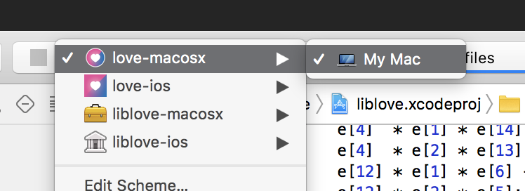

# Ghost (name TBD)

Hello traveler! I'm Ghost. Don't worry, I'm not the scary kind of ghost, just a spirit that likes to
explore, probably like yourself. Anyways... You probably want to just try this thing out. So let's
do that!

## Run Ghost

### macOS

- You must have git-lfs installed. Do not clone the repository without git-lfs. Install [Homebrew](https://brew.sh/). Then run `brew install git-lfs`. Then run `git lfs install`.
- Open './macosx/ghost.xcodeproj' with Xcode.
- Run the 'ghost-macosx' target:
  

### Windows

- Install https://gitforwindows.org/. Use this program to clone this repo (not WSL git).
- Install CMake. https://cmake.org/download/
  - Make sure to check the "add to PATH for current user" option.
- Install Visual Studio 2017. https://visualstudio.microsoft.com/vs
  - When you are prompted to install some "Workloads", at the minimum you want "Desktop development with C++". You can come back to this screen later if you want more things.
- Install http://nsis.sourceforge.net.

#### Debug build

- Make sure `git lfs` is initialized.
- Open the Git Bash utility that comes with Git for Windows and navigate to the `megasource` directory.
- In 'megasource/', run './run_cmake.sh'.
- Open and build the 'ALL_BUILD.vcxproj' file inside of 'megasource/build/'.
- Run the application at 'megasourse/build/Debug/Castle.exe'.
- If the build succeeds but is unable to write Castle.exe, make sure any existing Castle processes are terminated and try again.

#### Release build

- Run './release.sh' in 'megasource/'. Use the installer at 'megasource/CastleSetup.exe' and then run Castle from the start menu.

### Linux

- You will need the following library dependencies, however they are distributed
  in your distribution of Linux: SDL2, libGLU, openal, luajit, libdevil,
  freetype, physfs, libmodplug, mpg123, libogg, libvorbis, libtheora, openssl.
- You will also need CMake and the usual gcc commands.
- In the 'love/' directory, run `cmake -H. -Bbuild`.
- Then go into the 'build/' directory that created, and run `make` (tip: add
  `-j5` as an argument to use more CPU and less time).
- This results in a 'love' binary in that directory.
- Now from the 'base/' directory at the root of your checkout of this
  repository, run `../love/build/love .`.

## Portals

Portals offer views into content from the web to render as a Lua/Love game. That's how the 'Base'
experience included with Ghost loads other experiences. You can load your own portals that you
create, and have those portals load other portals, and so on. You have full freedom now how
your portal loads are displayed, given input, and managed.

Edit 'base/main.lua' to change the default portal(s) opened by the Base.

The current portal you are in is available as the global object `portal`. You can create a new
portal with `local newPortal = portal:newChild(<url>)`. You then need to call `newPortal:draw()` or
`newPortal:keypressed(...)` or such to forward events to it. This gives you full control over how
sub-portals work. 'base/main.lua' has an example of creating portals and controlling them

## Lua

- We use LuaJIT for Lua, which is exactly [Lua 5.1](https://www.lua.org/manual/5.1/) with some
  [additions](http://luajit.org/extensions.html).
- Lua is mostly sort of like JavaScript and hopefully should be easy to pick up! Here's [a good introduction](http://lua-users.org/wiki/TutorialDirectory) to the language.
- There are a lot of good benefits from using Lua, and also of course tradeoffs, vs. other languages
  (JavaScript probably being the main other one). Here are some of the many benefits:

  - Quite small and easy to pick up for people new to programming (subjective I guess).
  - LuaJIT makes Lua extremely fast. The JIT runs on macOS, Windows and Linux. On iOS and Android,
    only the interpreter runs, but LuaJIT's interpreter is still much faster than the original Lua
    one.
  - The Love game engine is available. It's open source, has breaking changes to its interface only
    approximately once every 3 years, and the code is small and neat enough for it to be
    well-understood by the whole team. It's well-documented. It's API is the same across all
    the desktop and mobile platforms Ghost supports.
  - Coroutines make non-blocking asynchronous calls possible without having to explicitly `await`
    them. This made it possible to wrap the `require` call in Lua to add network fetching, which lies
    at the core of Ghost.
  - There's a lot more...

### Style

I let IntelliJ's auto-format handle styling personally. We're not using an auto-formatter like
'prettier' for JavaScript yet and just hoping authors will use sane formatting. A few notes:

- Error messages should be lowercase, short, surround user-given strings in ' and code in `.
  Example:
  ```
        error("no working `url` found for '" .. origPath .. "' -- please check the `require` "
                .. "`path` or the network connection")
  ```
- Use ' to delimit strings rather than ".
- Note that `assert(val, msg)` will evaluate to `msg` if it's truthy, else raise an error mentioning
  `msg`. This is useful to do things like `local thing = foo(assert(arg, "didn't get the arg!"))`.

### OpenSSL

From here: https://www.npcglib.org/~stathis/blog/precompiled-openssl/
luacrypto requires openssl 1.0.2. Using 1.1.0 results in this error:
`ghost-extensions\luacrypto\src\lcrypto.c(1299): error C2027: use of undefined type 'evp_cipher_ctx_st'`
See https://github.com/openssl/openssl/issues/962
